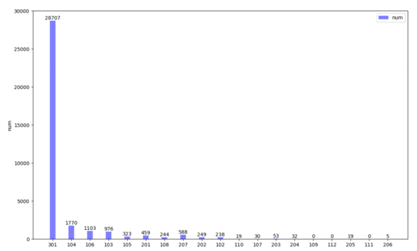
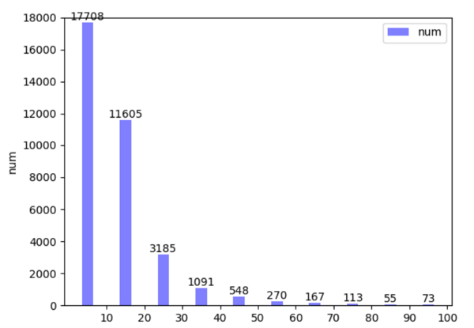

- **【赛事信息】** [2020百度之星开发者大赛：交通标识检测与场景匹配](https://aistudio.baidu.com/aistudio/competition/detail/39) 

任务说明：对于同一地点不同时间拍摄的两个图形序列，设计一个交通标志检测与匹配模型，给出两组序列图像中交通标志的匹配关系

团队信息：
队长：谢自强
队员：苏冬，董建伟，李俊
# 方案简介：
## 工程环境：
- Python3.7
- PaddlePaddle1.8，
- fork 官方基线系统

##  模型地址 
最高分模型：[model](https://pan.baidu.com/s/1yJoOeFL121ALMai5ZdJjNQ) 
提取码：yxx6 

## 初赛阶段 
### 数据分析 
初赛数据集包含训练集 37478 张，测试集 12599 张，检测类别分 19 个小类。 
 

                    图 1 训练集各类别目标数量统计 

通过对训练集的目标数量分析，可以发现各个类别数量极度不均衡，如图 1 所示。19 个类别中有 3 类数量为 0，有 1 类的数量仅为个 位数，有 5 类数量在两位数，而数量最大的“301”类别达到 28707。
 

 
                    图 2 训练集目标宽高区间统计 

通过对训练集的目标大小分析，发现小目标的占比非常大，如图2 所示。条形图所在区间表示目标宽高均在该区间范围内的数量，从 图中可以看出，宽高大小在20*20以下的目标占比超过80%，仅10*10 以下的占比也超过50%，因此数据整体以小目标为主。

### 数据集
- 训练集:采用全部初赛训练集进行训练，目的是使得训练集足够大，有利于模型训练和优化，对于有些样本量非常少的类别，单独分出验证集会使得训练集更缺少相关类别数据，反而不利于优化模型效果。 
- 验证集：从全部数据集中随机挑选约 20%左右的数据作为验证集，仅仅作为查看模型效果的参考，不作为选模型依据；

- 数据统计脚本：
|训练集目标宽高区间统计|训练集各类别目标数量统计|
|:---|:---|
|PaddleDetection_traffic/Cal_target.py|PaddleDetection_traffic/baidu_data.py|

 
- 提取验证集脚本：PaddleDetection_traffic/split_val.py 
### 评价标准分析 
F1 score 作为准确率和召回率的一个调和平均，必须同时关注准确率和召回率，因此合适的阈值选择就显得非常重要，单纯的追求一个反而无法得到好的分数。 
1.3 检测思路和方案 
1.3.1 baseline 阶段 直接利用 baseline 自带的模型生成结果，提交得分为 0.46782； 初始阶段利用训练集对 baseline 的检测模型进行微调，但是提交
后得分反而降低，这一点从各个队伍提交的成绩来看，很多人应该都
遇到了这个问题； 
配置文件： 
faster_rcnn_r50_vd_fpn_2x.yml faster_rcnn_r50_vd_fpn_2x_test.yml faster_fpn_reader.yml 
其中 faster_fpn_reader.yml 与其他 Faster_rcnn 模型共用； 
1.3.2 尝试更多检测模型 One-stage：采用 yolov4 作为检测模型，得分较低； 配置文件：yolov4_cspdarknet.yml       yolov4_cspdarknet_test.yml       yolov3_reader.yml 
Two-stage： 
2020 百度之星开发者大赛：交通标志检测与场景匹配 
4 
 
1）采用 Faster rcnn+ResNeXt101_vd+dcn+fpn 方案，约提升 0.02；
 
配置文件： 
faster_rcnn_dcn_x101_vd_64x4d_fpn_1x.yml faster_rcnn_dcn_x101_vd_64x4d_fpn_1x_test.yml faster_fpn_reader.yml 
2）采用 cascade rcnn+cbr200_vd+dcn+fpn 方案，得分下降，未有
提升； 
配置文件： 
cascade_rcnn_cbr200_vd_fpn_dcnv2_nonlocal_softnms.yml cascade_rcnn_cbr200_vd_fpn_dcnv2_nonlocal_softnms_test.yml 
3）采用 cascade rcnn+ResNeXt101+dcn+fpn 方案，此方案初赛阶
段后期开始训练，初赛结束时尚未完成，因此初赛没有做测试； 
配置文件： 
cascade_rcnn_cls_aware_dcn_x101_vd_64x4d_fpn_nonlocal_softn ms.yml cascade_rcnn_cls_aware_dcn_x101_vd_64x4d_fpn_nonlocal_softn ms_test.yml 
注：初赛配置文件均在 PaddleDetection_traffic/configs/traffic1 文
件夹下； 
1.3.3 检测参数 根据 F1 的指标评价方法，检测输出的结果必须兼顾准确率和召
回率，根据提交结果得分进行合适阈值的选取，最终确定一个比较合
2020 百度之星开发者大赛：交通标志检测与场景匹配 
5 
 
理的数值为 0.53，通过对阈值的选取，提交结果涨分明显； 
1.3.4 小目标问题 
针对训练集中存在的大量小目标问题，通过简单的增大网络输入
分辨率来提升小目标的检测效果，但是也同时带来了另外一个问题，
训练时间和显存占用量明显增加； 
1.3.5 数据增强 采用 paddle 自带数据增强 v1，但是发现没有明显效果，最终放
弃； 
v1 所在文件：ppdet/data/transform/autoaugment_utils.py 
1.3.6 多尺度训练 用于cascade模型中，设置target_size范围[800, 832, 864, 896, 928, 960, 992, 1024]，max_size 设置为 1821； 
1.3.7 类别不均衡问题 class-aware sample 可以缓解类别不平衡问题，在配置文件名中含 有 cls_aware 的均有配置； 
1.4 匹配思路和方案 初赛阶段匹配模型采用 baseline 模型进行匹配预测，主要侧重与
匹配输出的阈值调节和匹配策略分析； 
1.4.1 匹配参数 同样是基于 F1 score 的计算，匹配阈值的选取对最终得分非常重 要，通过多轮调整测试选定 0.66 作为最终阈值，和检测阈值一样，
匹配阈值的调整也带来了明显的涨分。 
2020 百度之星开发者大赛：交通标志检测与场景匹配 
6 
 
1.4.2 匹配分析 
通过分析匹配结果，可以发现存在大量的重复匹配，重复匹配是
指一个目标与另一张图片中的多个目标匹配，而实际应该是最多有一
个匹配，因为只有是同一个目标实体之间的匹配才是正确匹配，因此
重复匹配必然也就存在错误匹配。 
 
图 3 重复匹配示意图 具体来说，如图 3 所示，假设 A组中检测出目标 A1，在 B 组某 一张图片中检出同类型目标 B1 和 B2，理论上 A1 只能匹配 B1 或 B2 中的一个，如果出现了 A1 和 B1、A1 和 B2 匹配则必然有一个是错 误的；更进一步的，如果 A 组中一张图片同时检出了 A1 和 A2，B 组中某一张图片也检出了同类型的 B1 和 B2，还会存在 A1 和 B1、 A1 和 B2、A2 和 B1、A2 和 B2 匹配的情况，但是实际情况下，最多
只有两个匹配是正确的，这就导致实际的匹配结果中存在大量的错误
匹配，使得 F1 值难以提高，因此对重复匹配的过滤很重要。 
1.4.3 匹配策略 1）首先考虑到的是去掉不同类型的匹配，不同类型不能匹配； 2）根据相似度，对于重复的匹配直接保留相似度最小的一组，
2020 百度之星开发者大赛：交通标志检测与场景匹配 
7 
 
但是实际测试得分降低，分析应该是存在某些错误匹配的相似度较高
（同一类型，但不是同一个目标实体），仅保留最相似的反而会去掉
很多正确的匹配； 
3）先保留最相似的两组（如果有两组或以上），但是根据余弦
距离之差去除距离较大的一组。理论上正确的匹配余弦距离都应该很
小，因此如果重复匹配的余弦距离之差较大，则其中距离较大者应为
错误匹配并去除，而如果两组距离之差很小，则说明较大的一组仍有
可能是正确匹配，保留。 
 
图 4 根据阈值差去除重复匹配 如图 4 所示。左图中与 A1 相匹配的 B1 和 B2，余弦距离很接近， 二者之差为 0.05，可以认为 A1 和 B2 也可能是正确匹配，而 A1 和 B1 可能不是同一个目标实体，有可能是错误匹配，但仅从余弦距离
无法判定准确的结果，因此两个匹配结果均保留。而右图中两个匹配
结果的余弦距离相差较大，所以二者的较大者可能是错误匹配，去除。
 
经过多次尝试，最终确定余弦距离之差为 0.1，最为有效，提分
效果明显； 2、复赛阶段 2.1 数据分析 复赛数据量相当庞大，几乎是初赛的 4 倍，为了得到更加足够充
2020 百度之星开发者大赛：交通标志检测与场景匹配 
8 
 
足的训练数据，采用将初赛数据添加到复赛数据集的方案，最终训练
集包含图片 133046 张，测试集包含 41125 张，更大的训练集也使得 训练一个 epoch 的时间更长。 
 
图 5 复赛+初赛数据各类别目标数量统计 
 
图 6 复赛+初赛数据目标大小统计 通过图 5、图 6 与图 1、图 2 的对比，可以看出，复赛训练集中
各类别数量分布与目标大小分布与初赛数据分布相似，各 类别数量仍
2020 百度之星开发者大赛：交通标志检测与场景匹配 
9 
 
然是不平衡，而且小目标占比非常大。 
训练集：与初赛类似，仍采用全部数据进行训练，确保类别较少
的类别能有最多的样本进行训练； 
验证集：在全部数据集中随机选取 20%~30%左右； 
2.2 检测模型 
2.2.1 检测模型方案选择 复赛检测模型共尝试 4 个，但是只有一个效果较好。 1）采用 cascade rcnn+ResNeXt101+dcn+fpn 方案，此方案测试效
果较好，也是最终采用的检测方案； 
配置文件： 
cascade_rcnn_cls_aware_dcn_x101_vd_64x4d_fpn_nonlocal_softn ms.yml cascade_rcnn_cls_aware_dcn_x101_vd_64x4d_fpn_nonlocal_softn ms_test.yml 
训练方法：初赛数据集上训练 13 万次，复赛在初赛 13 万基础上 继续训练至 32 万次，然后在 32 万次基础上调整分辨率继续训练至 40 万次，分辨率调整思路为去掉多尺度训练，直接采用多尺度中最 大尺度训练，在实际测试中调整后的效果最好，取 40 万次的模型提
交最终结果。 
训练至 32 万次的参数配置： max_iters: 320000 
anchors：与 baseline 保持一致 
2020 百度之星开发者大赛：交通标志检测与场景匹配 
10 
 
base_lr: 0.005 milestones:[200000, 270000] target_size: [800,832,864,896,928,960,992] max_size: 1821 batch_size:2 
测试参数： 
target_size: [992] max_size: 1764 batch_size:1 
注：当前工程内文件为最后增大分辨率微调至 40 万次的参数配 置，前 13 万次的配置在初赛配置文件中； 2）采用 cascade rcnn + resnet200+dcn+fpn 方案，验证集测试 map
不高，没有采用； 
配置文件： 
cascade_rcnn_cls_aware_r200_vd_fpn_dcnv2_nonlocal_softnms.ym
l 
cascade_rcnn_cls_aware_r200_vd_fpn_dcnv2_nonlocal_softnms_te st.yml 
3）采用 cascade rcnn + cbr200+dcn+fpn 方案，验证集测试 map
不高，测试后提交得分并没有提升，没有采用； 
配置文件： 
cascade_rcnn_cls_aware_cbr200_vd_fpn_dcnv2_nonlocal_softnms.
2020 百度之星开发者大赛：交通标志检测与场景匹配 
11 
 
yml 
cascade_rcnn_cls_aware_cbr200_vd_fpn_dcnv2_nonlocal_softnms_ test.yml 
4）采用 cascade rcnn + senet154+dcn+fpn 方案，最后没有训练完， 但是在训练后期发现 map 也是较低； 
配置文件： 
cascade_rcnn_cls_aware_dcnv2_se154_vd_fpn_gn_s1x_softnms.ym
l 
注：复赛配置文件均在 PaddleDetection_traffic/configs/traffic 文件
夹下； 
2.2.2 检测阈值调整 通过测试分析，阈值选择 0.63、0.66、0.69 等值最终结果优于初 赛阈值，并最终选取合适的阈值为 0.63，与初赛略有不同； 
2.3 匹配方案 
2.3.1 匹配模型尝试 1）复赛初期仍使用 baseline 模型，仍能取得不错结果； 2）同时利用复赛数据集进行 baseline 模型微调； 
将初赛数据和复赛数据合并并打乱顺序，分了 data_train1
和 data_train2（9:1），先在 data_train1 上训练,然后再在
data_train2 上训练，最后在 data_train1 上微调。训练命令参
数设置: 
train_batch_size=256 class_dim=35591 lr=0.01 lr_str
2020 百度之星开发者大赛：交通标志检测与场景匹配 
12 
 
ategy="piecewise_decay" lr_steps="9000,15000" total_ite
r_num=200 000 image_shape = "3,64,64" save_iter_step = 
 4000 loss_name="softmax"  
其他参数均为默认值。训练至 24000 次迭代后 lr 下降至 
0.0001，再次将 lr 设为 0.01,断点续训，经过大约 72000 次迭
代，loss 下降到 1.1 左右开始波动，之后又近 20000 次迭代 loss
均无明显下降，中止训练。 
finetune 模型参数设置: 
train_batch_size=75 lr=0.001 lr_strategy="piecewis" 
其他参数默认。最终采用训练 52000 次的模型。 
3）训练更大的 ResNet101、ResNet152 等网络； 
细分类模型 Resnet101 参数设置: 
train_batch_size=256 class_dim=9993 lr=0.01 lr_stra
tegy="piecewise_decay" lr_steps="9000,15000" total_iter
_num=18000 loss_name="softmax" 
其他参数均为默认值。训练 18000 个 iter,loss 1.695317,
 acc1 0.6852。 
4）增大或减小网络输入分辨率； 
尝试设置匹配模型输入分辨率为"3,32,32"和"3,320,320"。 
训练中发现匹配的训练非常慢，因此实际测试基本是在复赛中后
期。测试对比发现，ResNet101 和 ResNet152 的效果均不如微调的 ResNet50 网络的效果好，且修改了网络分辨率后得分也会降低，分
2020 百度之星开发者大赛：交通标志检测与场景匹配 
13 
 
析原因可能是训练太慢，模型总体训练时间过短，没有达到最优效果，
最终采用微调了 52000 次的 ResNet50 模型，阈值 0.66。 
2.3.2 匹配策略 
初赛主要根据余弦距离之差进行重复匹配的过滤，但是不可避免
仍然存在相似度接近的重复匹配。因此考虑到相匹配的两组图片是同
一地点的场景，目标实体本身的相互关系是固定的，因此采用目标在
图片中的相对位置进行比对，进一步去掉错误匹配。 
 
图 7 目标相对位置关系示意图 如图 7 所示，具体来说，如果 A组中目标 A1 同时与 B 组某一张 图片中目标 B1 和 B2 匹配，根据 A1 在其图片中所在的位置，选择 B 中两个目标之一保留。假设 A1 位于所在图片的左半侧，则正确的匹 配目标也应该在相同的半侧，否则就是错误匹配，因此保留 A1 与 B1 匹配的结果，去除与 B2 匹配的结果。 更进一步的，如果 A 组中一张图片同时检出了 A1 和 A2，与 B 组某一张图片的 B1 和 B2，存在 A1 和 B1、A1 和 B2、A2 和 B1、 A2 和 B2 匹配的情况，则判断 A1 与 A2、B1 与 B2 的位置关系，靠
左边的两个目标匹配结果保留，靠右边的两个目标匹配结果保留，目
2020 百度之星开发者大赛：交通标志检测与场景匹配 
14 
 
标位置交叉的两个匹配去除。 
匹配策略：metric_learning_traffic/utility.py 的 save_result 函数内；
 匹配结果可视化：metric_learning_traffic/vis_result； 测试时需添加 test_pic_path 参数，指定测试集图片所在文件夹；
 
## 参考引用 

- [1] 目标检测库: [https://github.com/PaddlePaddle/PaddleDetection](https://github.com/PaddlePaddle/PaddleDetection)

- [2] 模型库和基线: [https://github.com/PaddlePaddle/PaddleDetection/blob/release/0.3/docs/MODEL_ZOO_cn.md](https://github.com/PaddlePaddle/PaddleDetection/blob/release/0.3/docs/MODEL_ZOO_cn.md)

- [3] 度量学习库: [https://github.com/PaddlePaddle/models/tree/develop/PaddleCV/metric_learning](https://github.com/PaddlePaddle/models/tree/develop/PaddleCV/metric_learning) 